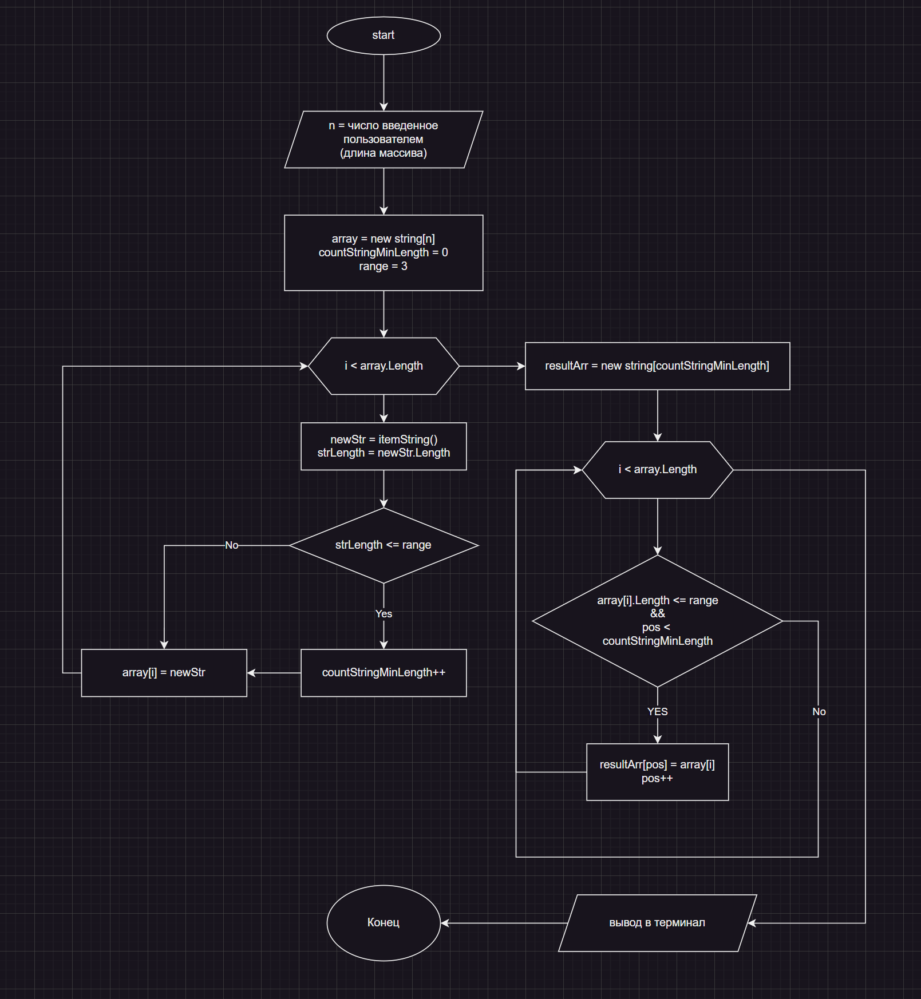

# Решение задачи

Блок-схема

Чтобы запустить программу пишем в терминале:

`dotnet run` 

Будет предложено ввести число, на основе которого сформируется массив нужной длины

## Метод формирования строки

Для формирования случайных строк был добавлен отдельный метод `itemString` .

Метод использует два класса; `Random` для получения строк разной длинны и получения случайного индекса переданной строки, `String` для хранения строки символов из которой будут формироваться случайные строки и конечной строки возвращаемой из метода.

Формирование строки происходит в цикле. Прежде чем запускать цикл, объявляются переменные с начальными данными:

- `size` = случайное число от 0 до 10
- `str` = строка символов из которой будут формироваться случайные строки с длинной `size` для массива

В цикле `for` устанавливается переменная итератор `i = 0` , назначается условие выхода из него `i < size` , третьим параметром записывается операция инкремента для итератора `i++` 

При каждой итерации в переменную `x` записывается случайный индекс символа из строки `str` , далее этот символ дописывается в переменную `randomstring` , содержимое которой при завершении работы цикла и возвращается из метода.

## Формирование начального массива

В цикле `for` устанавливается переменная итератор `i = 0` , назначается условие выхода из него `i < array.Length` , третьим параметром записывается операция инкремента для итератора `i++` 

При каждой итерации в цикле создается переменная `newStr` содержащая в себе результат работы метода `itemString` . А также переменная `strLength` содержащая длину возвращенной методом `itemString` строки.

Далее идет проверка соответствует ли длина строки условию записи строки в результирующий массив, и, если да, то в переменная `countStrMinLength` для учета того, какой длинны нам нужно сделать результирующий массив, увеличивается на 1.

В начальный массив записывается содержимое переменной `newStr`

## Формирование результирующего массива

Создаем новый массив `resultArr` с длиной равной `countStrMinLength`

В цикле `for` устанавливается переменная итератор `i = 0` , назначается условие выхода из него `i < array.Length` , третьим параметром записывается операция инкремента для итератора `i++` 

Далее проверяем что количество символов итерируемого элемента массива соответствует условию записи элемента в новый массив и переменная `pos` меньше длинны результирующего массива, то в результирующий массив на позицию с индексом `pos` записываем итерируемый элемент начального массива.

После завершения работы цикла делаем красивый вывод в консоль обоих массивов